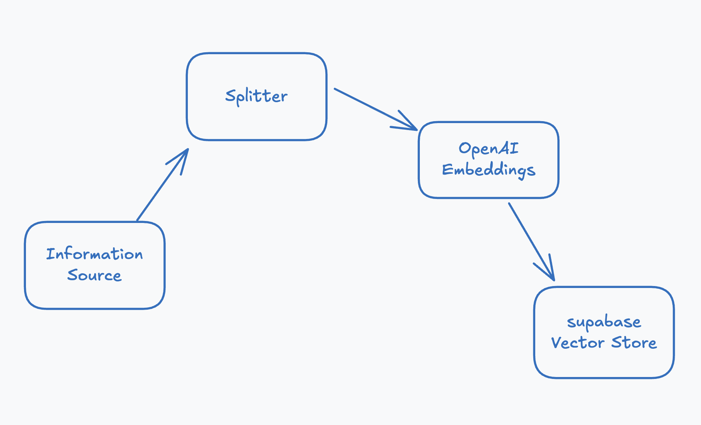

# 🧬 Search Engine with LLM + Embeddings
Tech Stack: Node.js + LangChain.js + PostgreSQL

A search system over documentation, FAQs, or internal data.

Stores vector embeddings, retrieves and uses LLM to summarize the most relevant content.

✅ Skills: Embedding generation, semantic search, LangChain.js, RAG pattern.

#

## LangChain ChatBot

Meet your Langchain virtual learning assistant! Our intelligent chatbot is here 24/7 to help you explore courses, answer questions, guide you through enrollment, and provide support whenever you need it. Whether you're a beginner or an experienced learner, the chatbot ensures you get quick, personalized help at every step.

#

Given a [text document](/public/data/faqs.txt) with a list of frequently asked questions, the document is split into chunks and converted to vector and saved into a supabase vector database.

Prompt Templates and promts were generated to retrieve standalone questions for user input and answers.

```javascript
const standAlonePromptTemplate = `
Given some conversation history (if any) and a question, convert the question to a standalone question.
conversation history: {conv_history},
question: {question},
standalone question:`;
const standAlonePrompt = PromptTemplate.fromTemplate(standAlonePromptTemplate);
```

Vectorised user input and found matches and generated answer from those matches using OpenAI.

## App Flow Diagram


# Chat Message Prompts for FAQ Retrieval

These are natural-language chat queries that users might enter to retrieve answers from the FAQ system.

## 🧠 General Course Information

-   What types of IT courses do you offer?
-   Do you have beginner-friendly courses?
-   Are your courses self-paced or scheduled?

## 📈 Skill Levels and Specializations

-   Do you have intermediate or advanced courses?
-   What are your best courses for career changers?
-   Do you offer programming courses?

## 💼 Career Support and Certification

-   Do your courses provide certificates?
-   Are your certificates accredited?
-   How do I get my certificate after completing a course?
